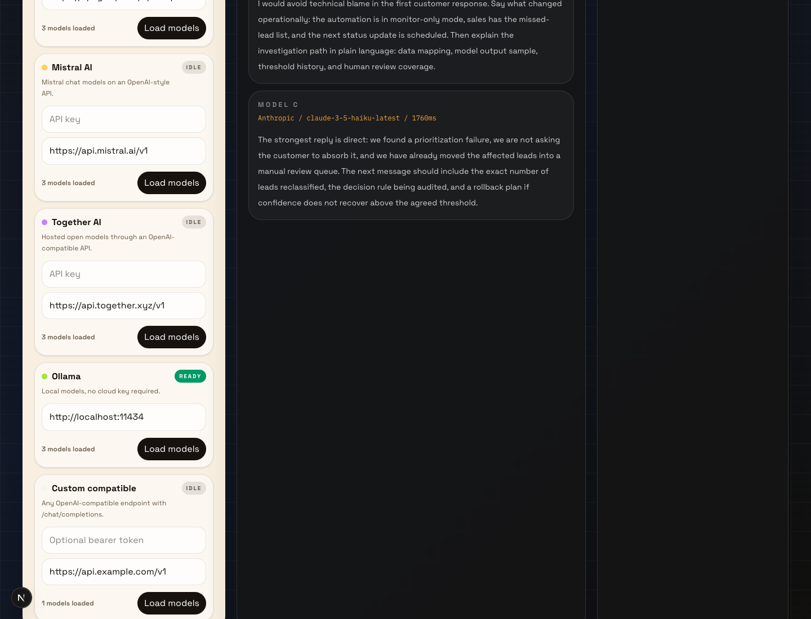

# Blind LLM Arena

Private blind battles for comparing LLMs on real business automation tasks.



Blind LLM Arena lets you paste provider keys, load available models, run the same prompt against 2-4 models, hide model identities, vote for the best answer, and build a local leaderboard. It is designed for practical AI workflow evaluation before a model is shipped into support, sales, RAG, or internal automation.

## Why this exists

Most teams choose models from benchmarks, brand names, or vibes. This project makes the decision operational:

- Compare models on the exact tasks your automation must handle.
- Keep answers anonymous until after the human vote.
- Track local win rate, latency, and battle history.
- Run without accounts in demo mode.
- Connect real providers when you are ready.

## Providers

Supported out of the box:

- OpenRouter
- OpenAI
- Anthropic
- Google Gemini
- Groq
- Mistral AI
- Together AI
- Ollama
- Any OpenAI-compatible endpoint

Keys are stored in browser localStorage and sent only to the local Next.js API route for the active request. The app does not store provider keys server-side.

## Features

- Blind model battles with randomized model order.
- Provider model sync through `/api/models`.
- Parallel model calls through `/api/battle`.
- Business task presets: support reply, lead scoring, grounded RAG answer, and automation memo.
- Shared system prompt and temperature controls.
- Local leaderboard with win rate, battle count, and average latency.
- Battle log with judge notes.
- JSON export for any battle.
- Demo mode that works without API keys.

## Quick start

```bash
npm install
npm run dev
```

Open [http://localhost:3000](http://localhost:3000).

## Real provider setup

1. Paste an API key in the provider card.
2. Click `Load models`.
3. Select models in the lineup.
4. Run a battle.
5. Vote before revealing identities.

For Ollama, keep the default base URL and run a local model:

```bash
ollama pull llama3.2
ollama serve
```

## Architecture

```text
src/app/page.tsx              UI entry
src/components/arena-app.tsx  client-side arena, provider dock, leaderboard
src/app/api/models/route.ts   provider model discovery
src/app/api/battle/route.ts   parallel battle execution
src/lib/providers.ts          provider registry and shared types
src/lib/provider-runtime.ts   server-side provider adapters
src/lib/arena-data.ts         presets, demo answers, leaderboard types
```

## Provider adapter strategy

OpenRouter, OpenAI, Groq, Mistral, Together, Ollama, and custom endpoints use OpenAI-compatible chat completions. Anthropic and Google use their native message/generateContent APIs. This keeps the project dependency-light and makes it easy to inspect or extend provider behavior.

## Scripts

```bash
npm run dev
npm run lint
npm run build
```

## Portfolio positioning

This is intentionally a small product, not a benchmark paper. The value is in the workflow: model selection becomes a repeatable business decision with human preference, latency, and task-specific evidence.
